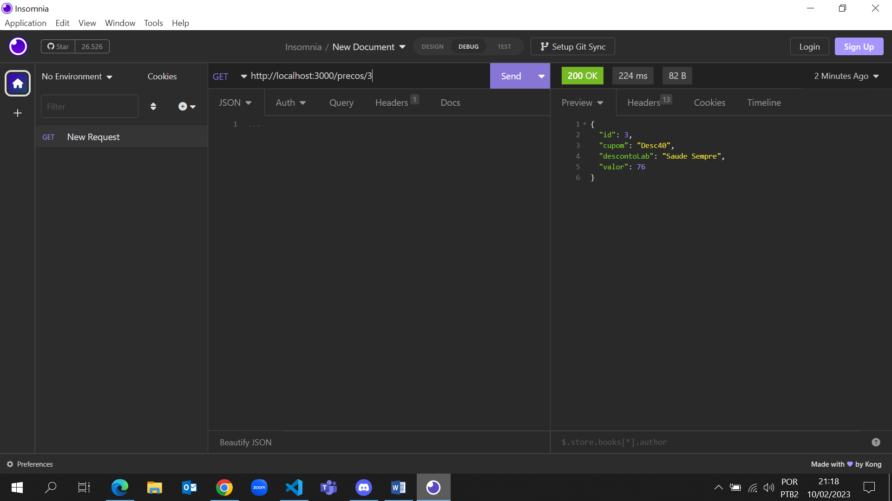
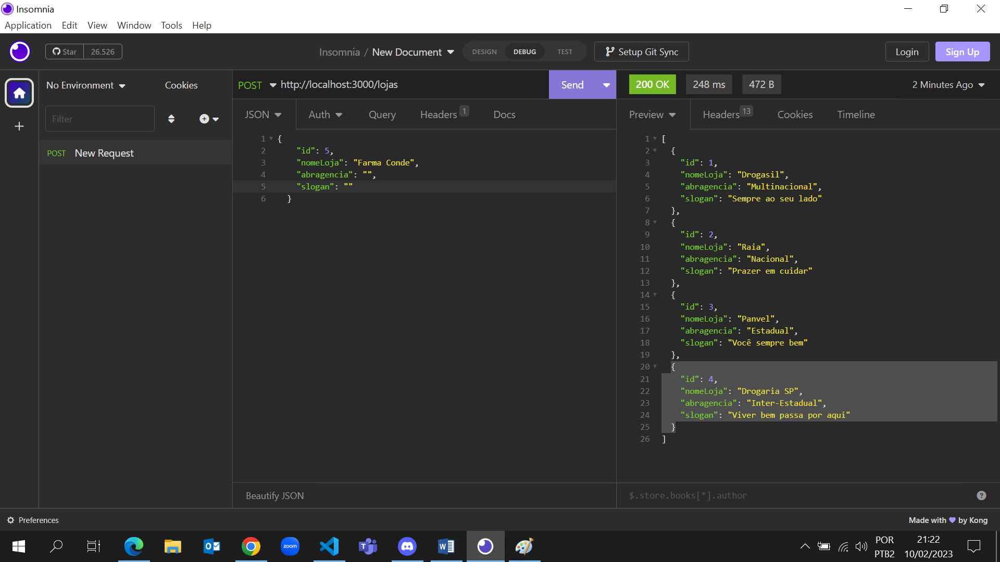
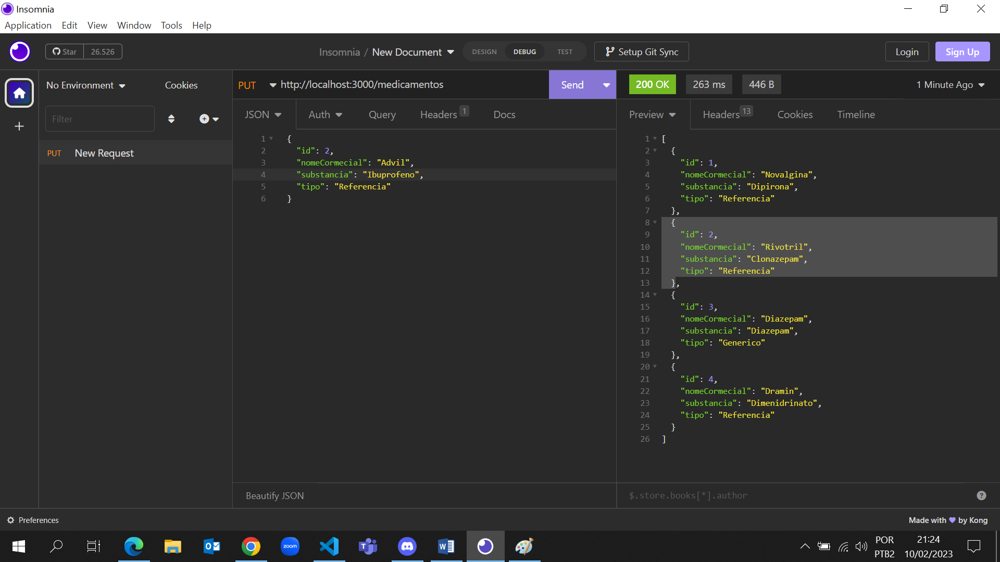
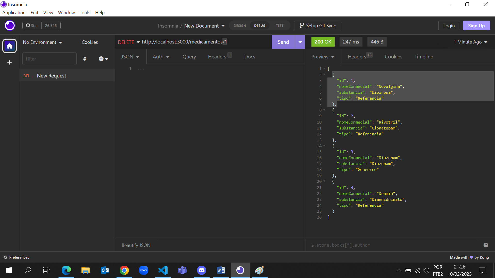

# Estão Servidos?

# Projeto Individual módulo 3 - Resilia Educação
# <br>Tema escolhido - Farmácia 

# Tecnologias utilizadas

> 
> 

> 

# <br> Objetivo do projeto

Densenvolver um servidor de teste banco de dados, este servidor foi criado usando a biblioteca json-server juntamente com o node.js.<br>
Como requisito o projeto deveria conter duas ou mais rotas, cada rota contendo pelo menos três dados, rotas nas quais o usuário pode realizar o CRUD (CREATE, READ, UPDATE, DELETE), por meio do, POST(criar um novo dado na rota), GET(ver um elemento da rotação), PUT(atualizar um dado da rota), DELETE(excluir um dado da rota)
<br>Como o tema escolhido foi farmácia as rotas do arquivo são: lojas, medicamentos e preços.

# <br>Passo a Passo de como rodar o projeto:

<br>Faça um clone local do meu repositório em sua maquina:
<br>

```bash
  https://github.com/tiadeabatista/M3-PI.git
```  
<br>

> Depois de feito o clone do repositório instale o json-server no vscode atrvés do comando:

npm i json-server


> Depois do json-server instalado, execute o comado para ver/assitir as rotas através de um endereço de URL local, comando:

npx json-server --watch db.json <br>
> Para executar as rotas personalizadas utilize;<br>

json-server -r routes.json --watch db.json

> Depois deste comando aparecerão as URL(s):

```bash
 Resources
  http://localhost:3000/lojas       
  http://localhost:3000/medicamentos
  http://localhost:3000/precos      

  Home
  http://localhost:3000
```
Três URL(s) uma para cada rota e uma URL global (home). Para abrir no navegador basta segurar a tecla CTRL e clicar em um dos links desejado ou copiá-lo e colar na barra de endereços do navegador.

#
> CRUD - (CREATE, READ, UPDATE, DELETE) <br><br>
> OU métodos HTTP;<br><br>
GET: Utilizado para obter um recurso<br>
POST: Utilizado para cadastrar uma informação<br>
PUT: Utilizado para alterar um recurso<br>
DELETE: Utilizado para deletar um recurso


<br>Para fazer as requisições dos métodos HTTP, pode ser ultilizado algumas ferramentas como o Insomnia, link para baixá-lo; 

````bash
 https://insomnia.rest/
 ````
#
<br>Método GET - Permite visualizar um elemento de forma individual, para isso basta colocar / e o id desejado ao final da URL.



<br>Método POST - Permite inserir novos dados em determinada rota basta somente digitar o que deseja acrescentar.



<br>Método PUT - Permite a alteração de determinado dado dentro da rota escolhida, basta digitar a alteração que deseja fazer.



<br>Método DELETE - Permite apagar determinado dado dentro da rota desejada, basta inserir ao final da URL o id do dado que desejar deletar.




